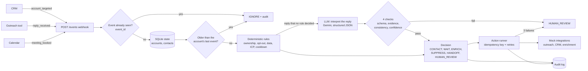

# Growth Orchestration System

A small system that answers one question for every outbound account at Clara:

> **What is the next best action for this account, and can we safely automate it?**

It receives events from the CRM, the outreach tool and the calendar, keeps the state of each account,
decides with deterministic rules what must be exact, uses an LLM only to read what prospects write,
executes the action through (mock) integrations and records every decision in an audit log.

`event -> state -> rules -> AI (replies only) -> decision -> action -> audit`

Built by Elio Giacosa. Stack: Python, FastAPI, SQLite and Gemini (free tier).

---

## Quick start

Requirements: Python 3.11+.

```bash
pip install -r requirements.txt
```

Run the automated tests (offline, no API key needed):

```bash
python -m pytest -v
```

Run the demo console (open http://localhost:8000):

```bash
python -m uvicorn app.main:app --port 8000
```

Sample data: `data/seed_accounts.json` (30 real companies from Brazil, Mexico and Colombia, with fictitious people,
emails and tax IDs). In the console, "Load CRM snapshot" loads it and "Send 30 accounts" runs the outbound list.
Without the console, `python scripts/demo.py` runs the same flow in the terminal.

Run the AI evaluation suite against the real model (needs `GEMINI_API_KEY`):

```bash
python evals/run_evals.py
```

Optional environment variables:

| Variable | Purpose |
|---|---|
| `GEMINI_API_KEY` | Enables the real model. Without it, every reply goes to human review (safe default). |
| `GEMINI_MODEL` | Defaults to `gemini-flash-lite-latest`. |
| `WEBHOOK_SECRET` | If set, `POST /events` requires the header `X-Webhook-Secret`. |
| `DEMO_MODE` | `1` by default. Set `0` to remove the demo endpoints that reset the database. |

---

## Architecture



| File | Responsibility |
|---|---|
| `app/main.py` | Webhook (`POST /events`), read API and demo console |
| `app/orchestrator.py` | The flow: claim the event, check order, update state, decide, act, audit |
| `app/rules.py` | Deterministic business rules (no AI) |
| `app/ai.py` | Reply interpretation with the LLM and its validation |
| `app/actions.py` | Executes external actions with idempotency keys and retries |
| `app/integrations.py` | Mock outreach, CRM and enrichment, including failures |
| `app/taxids.py`, `app/countries.py` | Tax ID formats with check digits (CNPJ, RFC, NIT) and country normalization |
| `app/db.py` | SQLite schema and access |
| `config/icp.json` | ICP, thresholds and phrase lists, editable by Growth without code changes |
| `tests/` | Automated tests of the business logic |
| `evals/` | AI evaluation cases, runner and results |
| `docs/` | Measurement plan and decision log |

---

## How a decision is made

Rules run first, in this order. The first one that matches wins.

| Rule | Condition | Decision |
|---|---|---|
| duplicate_event | Same `event_id` already processed | IGNORE |
| stale_event | Event older than the account's last event | IGNORE |
| R0 | Same tax ID as another account in the same country | HUMAN_REVIEW (merge in the CRM) |
| R1 | Already a customer | SUPPRESS |
| R2 | Open opportunity or assigned AE | SUPPRESS (and notify the AE if the prospect replied) |
| R3 | Contact opted out, or account on do-not-contact | SUPPRESS |
| R4 | The reply asks to stop (70 phrases in Spanish and Portuguese, including Mexican, Colombian and Brazilian expressions) | SUPPRESS and opt out |
| R4b | The reply tries to give instructions to the AI | HUMAN_REVIEW |
| R5 | Missing or invalid data: email, name, title, language, tax ID with check digit, or an email domain that does not match the company | ENRICH |
| R6 | No legal entity in Brazil, Mexico or Colombia (kept for future markets), bank, sole proprietor, public sector | SUPPRESS |
| R7 | Already contacted less than 14 days ago | WAIT |
| R8 | Eligible account inside the ICP | CONTACT |

A personal email domain (Gmail, Hotmail, Yahoo) is accepted, because many Latin American companies
work with them, and it is flagged for the SDR. Company size and industry never block an account.

---

## Where AI is used, and where it is not

**Where:** interpreting a prospect's reply. The model returns structured JSON with the intent
(`interested`, `not_now`, `referral`, `question`, `not_interested`, `unclear`), a confidence score,
the language, qualification facts (timeline, current tool, decision maker, referral, meeting time)
and a quote from the reply that supports the intent.

**Why AI is appropriate here:** replies are free text, in two languages and full of local expressions
("qué pena con usted", "tá ok"). No rule list can anticipate every way of saying "yes", "not now" or
"talk to my accountant". The cost of an error is bounded, because the output is validated and can only
map to a small set of decisions.

**What AI may decide:** what the prospect meant, and which qualification facts it can quote.

**What AI may not decide:** contacting a customer, overriding an opt-out, sending anything, or changing
CRM data. Those belong to the rules. Unsubscribe requests and prompt injection attempts are caught by
rules before the model ever sees the text.

**How the output is validated.** An output drives an automatic action only if all four checks pass:

1. the JSON matches the schema (also enforced on the model side with `response_schema`)
2. the evidence quote appears in the reply (tolerant to case, accents and small typos, 90% fuzzy match)
3. the intent is consistent with the extracted facts (a referral must name a contact, "not now" cannot request a meeting)
4. the confidence is at least 0.8

**Ambiguity and low confidence:** `unclear`, low confidence, invalid JSON or a failed check go to
HUMAN_REVIEW. The system retries a malformed output once and never acts on an output it could not validate.

**Before letting it run autonomously in production:**

- an evaluation set of several hundred real replies labelled by SDRs, with more than 95% correct decisions and zero critical errors (never hand off someone who asked to stop)
- a few weeks in shadow mode, where the AI decides in parallel and SDRs compare
- a random sample reviewed by people after launch, and drift monitoring per language and country
- a kill switch that sends every reply back to human review
- a data processing agreement for sending prospects' text to the model provider (LGPD in Brazil, LFPDPPP in Mexico, Law 1581 in Colombia)

---

## Reliability

- **Duplicate events:** each event is claimed in `processed_events` before any work. A second copy, even if it arrives at the same time, is ignored and audited.
- **Out-of-order events:** an event older than the account's last event does not overwrite newer state.
- **Idempotent actions:** every external action has a key (`account:action:event_id`). A retry never sends twice.
- **Retries:** rate limits and server errors are retried up to 3 times with exponential backoff (0.5 s, 1 s).
- **Uncertain outcomes:** after a timeout the system asks the provider whether the action happened before retrying.
- **Give up safely:** after 3 failures the action is marked `failed` and the account goes to human review.
- **Ownership flags** (customer, AE, opt-out) only come from the CRM, never from a webhook payload.

## How the AI confidence works

The model returns a `confidence` between 0 and 1 together with the intent. It is the model's own estimate of
how sure it is: it is not a calibrated probability, and the system does not trust it alone. A reply is only
acted on when all four checks pass:

1. the JSON matches the schema,
2. the `evidence` (the exact words the model relied on) really appears in the reply,
3. the intent and the fields are consistent (for example, "not interested" cannot ask for a meeting),
4. the confidence is at least 0.8 (configurable in `config/icp.json`).

So a confident model that cannot point to real words in the reply still goes to a person. In production I would
calibrate the threshold with the evaluation set: label a few hundred real replies, check the accuracy at each
confidence level, and move the threshold to the point where automatic decisions stay above the accuracy Growth
accepts.

## Security

What is in place:
- **SQL injection:** every query is parameterized, and column names come from an allow list. A test sends an injection attempt in the payload keys.
- **Webhook:** optional shared secret, compared in constant time (no timing leak). Production: an HMAC signature per provider.
- **Input validation:** every event is validated by a schema (Pydantic). Unknown event types, missing fields and oversized texts are rejected before any logic runs.
- **Prompt injection:** caught by rules before the model (rule R4b), the reply is capped at 4,000 characters, the prompt treats the reply as data, and the model output must pass 4 checks.
- **Ownership flags** (customer, AE, opt-out) can only come from the CRM, never from a webhook payload.
- **Console (XSS):** every value shown on the page is escaped, so a reply with HTML or a script is displayed as text.
- **Secrets:** no key lives in the code. The API key is an environment variable, and `.gitignore` excludes the database and `.env`.
- **Demo data:** real companies, fictitious people, emails and tax IDs. Outreach is a mock: nothing is ever sent.

Known gaps, acceptable for a local prototype and listed for production:
- The read API and the console have no login. The server only listens on localhost by default.
- Demo endpoints can reset the database. They are disabled with `DEMO_MODE=0`.
- No rate limit and no request size limit on the webhook (production: API gateway).
- The audit log stores reply text and emails in clear (production: masking and a retention policy).

---

## Tests and AI evaluation

- `tests/test_system.py`: 60 automated tests covering every rule, duplicates, out-of-order events, retries, uncertain outcomes, AI validation, tax ID check digits, country normalization and security cases.
- `evals/`: 8 representative replies in Spanish and Portuguese. Latest run: **8/8 correct decisions** with `gemini-flash-lite-latest`. See `evals/results.md` and `evals/history.md`: the first run scored 7/8, the validation stopped the bad output, the prompt and schema were fixed, and the second run scored 8/8.

## Business impact

See [`docs/measurement_plan.md`](docs/measurement_plan.md). In short: a randomized holdout by account,
with **AE-accepted opportunities (SQOs) per SDR** as the primary metric and guardrails on opt-outs,
spam complaints, AE rejection rate and downstream win rate.

## Production thinking

- **Reliability:** a queue between the webhook and the workers, dead-letter queue for failed actions, replay of events from the queue.
- **Scale:** 50,000 companies per month is about 1,700 per day, small for a single worker. Move from SQLite to Postgres, rate limit per provider, batch LLM calls.
- **Observability:** metrics per decision and per rule, alerts on failure rate, AI decisions logged with the model version, a dashboard of the review queue.
- **Security:** HMAC webhook signatures, secrets in a vault, retention policy and masking of personal data in the audit log.
- **CRM integration:** in the demo, "Load CRM snapshot" wipes the database and reloads a fixed JSON file, so anything created with "Try a company of your own" disappears on the next reset. In production there is no reset: the CRM stays the source of truth. Accounts, contacts and ownership flags (customer, AE, opt-out) arrive through CRM webhooks and a nightly sync through the CRM API, and new companies enter the system only from the CRM target list or from enrichment, never typed by hand. Every decision and action is written back to the CRM, so SDRs and AEs see the same history.
- **Build vs buy:** buy enrichment and email delivery (data providers, an outreach platform, Customer.io), build the decision layer, which is where Clara's judgment lives.

## Assumptions

What was missing from the case, and what I assumed:

- **Language:** the case was written in English, so the system is in English. Prospects reply in Spanish or Portuguese.
- **Data:** 30 real companies from Brazil, Mexico and Colombia. Every person, email and tax ID is fictitious. CRM flags are simulated.
- **CRM and state:** there is no real CRM. A JSON file plays it, and step 1 of the console loads it. The CRM owns `account_id`.
- **SQLite:** it is the system's own state store, a stand-in. In production the source of truth for accounts stays in Clara's CRM, and this system keeps only what it needs to decide (processed events, actions, audit), in Postgres.
- **Events:** CRM, outreach tool and calendar send JSON through a webhook, each with an `event_id` and an `occurred_at` with its time zone. Three types: `account_targeted`, `reply_received`, `meeting_booked`.
- **Integrations:** CRM, outreach and enrichment are mocks that behave like real APIs, failures included. One outreach channel: email.
- **ICP:** inferred from Clara's public positioning: a legal entity in Brazil, Mexico or Colombia, from startups to enterprise. Banks are excluded (my assumption: a bank is more likely a partner or a competitor than a buyer), and so are sole proprietors and the public sector. It lives in `config/icp.json`, so Growth can change it.
- **Company existence:** tax IDs are validated by format and check digit. Existence would be confirmed with the tax authority or a data provider.
- **Company data:** countries, size, industry and legal type come from public registries through enrichment (CNPJ registry in Brazil, SAT and DENUE in Mexico, RUES in Colombia).
- **Contacts:** personal emails (gmail, hotmail) are accepted with a note, because many LATAM companies use them. An email from another company's domain goes to enrichment.
- **Time:** systems store time in UTC. The demo shows São Paulo time (UTC-3) to make it easier to follow.
- **Scale:** about 50,000 target companies per month, as the case says.

## Decision log

See [`docs/decision_log.md`](docs/decision_log.md).

## Development assistant

Claude Code (Claude Opus 5.5, medium effort), used to write and test the code faster. I defined the problem,
the rules, the assumptions and every decision, and I reviewed all the code.
